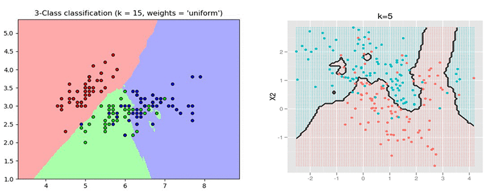
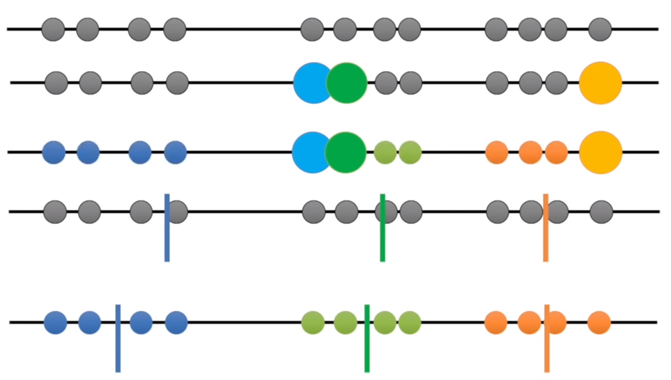

- KNN is supervised learning
- KNN can be a classification technique and also used for regression.
- Sklearn:
    - KNeighborsClassifier: classification
    - KNeighborsRegressor: regression

Figure Credit: <https://www.mathworks.com/matlabcentral/fileexchange/63621-knn-classifier>

### Here are some challenges:
- How to calculate the similarity (e.g., friends): distances between each data point, Euclidean distance.
- How to choose K: if we need to classify students into groups, then how to decide the number of K. ATTENSION: K represents how many neighbors you want to consider for the response; K does not mean number of groups.

Figure Credit: <https://aws.amazon.com/blogs/machine-learning/amazon-sagemaker-supports-knn-classification-and-regression/>

### KNN: How
- The KNN algorithm is belongs to the family of instance-based, competitive learning and lazy learning algorithms.
- Instance-based algorithms are those algorithms that model the problem using data instances (or rows) in order to make predictive decisions. The KNN algorithm is an extreme form of instance-based methods because all training observations are retained as part of the model, i.e. without data, your KNN model does not exist.
- It is a competitive learning algorithm, because it internally uses competition between model elements (data instances) in order to make a predictive decision. The objective similarity measure between data instances causes each data instance to compete to “win” or be most similar to a given unseen data instance and contribute to a prediction.
- Lazy learning refers to the fact that the algorithm does not build a model until the time that a prediction is required. It is lazy because it only does work at the last second. This has the benefit of only including data relevant to the unseen data, called a localized model. A disadvantage is that it can be computationally expensive to repeat the same or similar searches over larger training datasets.
- Finally, KNN is powerful because it does not assume anything about the data, other than a distance measure can be calculated consistently between any two instances. As such, it is called non-parametric or non-linear as it does not assume a functional form.

# KNN Advantages vs Disadvantages

#### Advantages:
- You do not need to make assumptions about data (i.e., linear vs nonlinear, normal distribution…)
- KNN is simple compared with other algorithm.
- Usually, KNN performs not bad
- KNN is robust to noisy training data, a few noise data points will not impact results a lot.
…

#### Disadvantages:
- You need to determine K.
- KNN is computationally expensive. It requires many calculations—distances.
- KNN requires a lot of memory.
- KNN needs to use all training data.
…

Figure Credit: <https://www.mathworks.com/matlabcentral/fileexchange/63621-knn-classifier>

### KNN: K changes

 
- K-means clustering aims to partition n observations into k clusters in which each observation belongs to the cluster with the nearest mean.
- If you want to separate different car models into 4 categories based on horsepower, engine displacement, and MPG, you can use K-means.
- KNN is unsupervised learning and a clustering algorithm (involves the grouping of data points). 
- K represents # of centroids.

Figure Credit: https://blogs.oracle.com/bigdata/k-means-clustering-machine-learning

#### An Example

Example is based on: https://www.youtube.com/watch?v=4b5d3muPQmA

### K-Means: Advantages vs Disadvantages
#### Advantages:
- Easy to implement.
- K-means model dynamically updated: centroid can be updated if new dataset is added.

#### Disadvantages:
- Hard to guess K
- Initial centroid can impact results
- K-means is time consuming. Need to calculate distances between new centroid in every loop.
- K-means method may not find out the global best solution. It sometimes returns local optimum.
- K-means is limited to linear cluster boundaries.

||[Index](../../)||| [Prev](../)|||[Next](../k-part3/)|||
