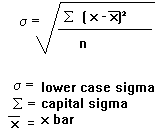

- Correlation can be used to represent relationships between variables.
  * Positive Correlation: both variables change in the same direction.
  * Neutral Correlation: No relationship in the change of the variables.
  * Negative Correlation: variables change in opposite directions.
- Pearson’s Correlation vs Spearman’s Correlation
  * The Pearson correlation coefficient (named for Karl Pearson) can be used to summarize the strength of the linear relationship between two data samples.
  * Spearman’s correlation coefficient (named for Charles Spearman) can be used to summarize the strength between the two data samples, if two variables may be related by a nonlinear relationship or two variables being considered may have a non-Gaussian distribution.

### Covariance vs Correlation
- Covariance is nothing but a measure of correlation. On the contrary, correlation refers to the scaled form of covariance.
- The value of correlation takes place between -1 and +1. Conversely, the value of covariance lies between -∞ and +∞. 
- Covariance is affected by the change in scale, i.e. if all the value of one variable is multiplied by a constant and all the value of another variable are multiplied, by a similar or different constant, then the covariance is changed. As against this, correlation is not influenced by the change in scale.
- Correlation is dimensionless, i.e. it is a unit-free measure of the relationship between variables. Unlike covariance, where the value is obtained by the product of the units of the two variables.

ADD EQUATIONS HERE

### Homework 3: Group Homework
- group Homework
- Complete "regression to the Mean" Exercise 1 and 2
- Try to use python 2, or the sample code with have weird issues.
- README.MD
  * Team member names and email addresses
  * 2 result graphs from exercise 1 and 2

### Correlation Sample Code
- Correlation_sample_code
- Plt.title: use pad to define padding away from your figure
- Df.corr can calculate correlation matrix between all columns
- Matshow can show correlation value comparison within a matrix.

||| [Index](../../)||| [Prev](../)||| [Next](../mlr/)|||
