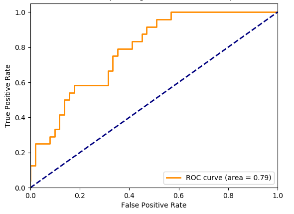

- What have we learned to evaluate a model so far?
  * Classification accuracy rate = correct/total
  * Classification: confusion matrix
  * Regression: RSS (usually used only for tuning coefficients)
- What will be introduced:
  * Classification: ROC
  * Regression: R^2
  * Regression: RMSE and MSE
  * Regression: MAE

## Review Classification Terms
- Based on: <https://www.geeksforgeeks.org/confusion-matrix-machine-learning/>
- Positive (P) : Observation is positive (for example: is an apple).
- Negative (N) : Observation is not positive (for example: is not an apple).
- True Positive (TP) : Observation is positive, and is predicted to be positive.
- False Negative (FN) : Observation is positive, but is predicted negative.
- True Negative (TN) : Observation is negative, and is predicted to be negative.
- False Positive (FP) : Observation is negative, but is predicted positive.

## Metrics for Evaluation: ROC Curve
- Classification Receiver Operating Characteristic (ROC) curve
- For binary classification (True or False)
  * True Positive Rate (TPR) (Sensitivity): True Positive Rate corresponds to the proportion of positive data points that are correctly considered as positive, with respect to all positive data points.

$$True PositiveRate=\frac{TruePositive}{FalseNegative+TruePositive}$$

False Positive Rate (FPR) (Specificity): False Positive Rate corresponds to the proportion of negative data points that are mistakenly considered as positive, with respect to all negative data points.

$$FalsePositiveRate=\frac{FalsePositive}{FalsePositive+TrueNegative}$$

Based on: <https://towardsdatascience.com/metrics-to-evaluate-your-machine-learning-algorithm-f10ba6e38234>

- FPR and TPR both have values in the range [0, 1]. FPR and TPR bot hare computed at threshold values such as (0.00, 0.02, 0.04, …., 1.00) and a graph is drawn. Area Under Curve (AUC) is the area under the curve of plot FPR vs TPR at different points in [0, 1].

Figure Credit: <https://towardsdatascience.com/metrics-to-evaluate-your-machine-learning-algorithm-f10ba6e38234>

- The font color=red>greater the value of AUC, the font color=red>better is the performance of our model.
Each curve is for one class. You may have multiple curves.

## ROC Example
## Micro Average vs Macro average in a multiclass classification problem:
- A macro-average will compute the metric independently for each class and then take the average (hence treating all classes equally) 
- A micro-average will aggregate the contributions of all classes to compute the average metric.
- In a multi-class classification setup, micro-average is preferable if you suspect there might be class imbalance (i.e you may have many more examples of one class than of other classes).
- More details at: <https://datascience.stackexchange.com/questions/15989/micro-average-vs-macro-average-performance-in-a-multiclass-classification-settin>

## Group Activity 5: ROC Curve
- Group Activity draw the graph and following these requirements:
  * X data: fpr[“micro”]
  * Y data: tpr[“micro”]
  * X axis from 0 – 1
  * Y axis from 0 – 1.5
  * X label: False Positive Rate
  * Y label: True Positive Rate
  * Title: Receiver operating characteristic example
  * Legend position: lower right

||| [Index](../../)||| [Prev](../lin-reg4/)||| [Next](../metrics-for-evaluation-2/)|||
