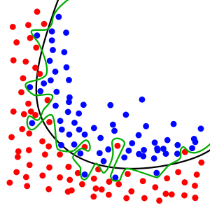

## Overfitting issue solution: Regularization
- Regularization Key idea:
  * Simpler model can avoid overfitting
  * For linear regression, “simpler” means smaller values for ϴ0, ϴ1, ϴ2, …, ϴn
  * Objective function = min(RSS + regularization term)
  * RSS is used to minimize error and regularization term is used to ensure a simpler model.
-Housing:
  * Features: $$x_1,x_2,...,x_100$$
  * Parameters:$$\Theta_0,\Theta_1,\Theta_2,...,\Theta_100$$
## Two popular regularization terms:
- L2 Regularization, aka Ridge regression

$$P= \alpha  \Sigma _{n=1}^{N} \Theta _n^2$$

- L1 Regularization, aka Lasso regression

$$P= \alpha  \Sigma _{n=1}^{N} |  \Theta _n |$$

- α is usually called regularization parameter and is used to control the tradeoff between ϴ small and RSS is also small. n starts from 1 instead of 0.

- Question: if α is a huge value, what will happen?
  * Y = ϴ0 => underfitting occurs when a statistical model cannot adequately capture the underlying structure of the data.
- Question: if α is a tiny value, what will happen?
  * Overfitting issue cannot be avoided.

- Figure Credit: <https://en.wikipedia.org/wiki/Overfitting>

$$\Theta_0 + \Theta_1x + \Theta_2x^2 + \Theta_3x^3 + \Theta_4x^4$$

## Regularization Sample Code

- Regularization
- How to tune regularization parameter? You will learn it in your HW4.

## Example Predicting Bicycle Traffic
- Regularization
- In your opinion, what are the key factors that can impact bicycle traffic?
- Based on the example, we will find out answers.
- Source Code:<https://colab.research.google.com/github/ruiwu1990/CSCI_4120/blob/master/Linear_regression/Regularization.ipynb>
||| [Index](../../)||| [Prev](../lin-reg3/)||| [Next](../lin-reg4/)|||
