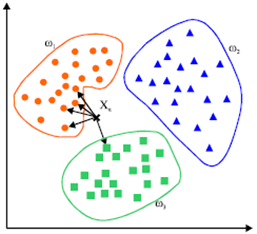

### First Machine Learning Model: KNN

- The idea is similar data records will be closer with each other. Like friends, if most of your friends like playing video games, then you may also enjoy playing video games.
- The model for KNN is the entire training dataset. When a prediction is required for an unseen data instance, the KNN algorithm will search through the training dataset for the k-most similar (distance) instances. The prediction attribute of the most similar instances is summarized (averaged) and returned as the prediction for the unseen instance.
- KNN is supervised or unsupervised?

- KNN is supervised learning
- KNN can be a classification technique and also used for regression.
- Sklearn:
    - KNeighborsClassifier: classification
    - KNeighborsRegressor: regression

### Here are some challenges:
- How to calculate the similarity (e.g., friends): distances between each data point, Euclidean distance.
- How to choose K: if we need to classify students into groups, then how to decide the number of K. ATTENSION: K represents how many neighbors you want to consider for the response; K does not mean number of groups.

# KNN Advantages vs Disadvantages

#### Advantages:
- You do not need to make assumptions about data (i.e., linear vs nonlinear, normal distribution…)
- KNN is simple compared with other algorithm.
- Usually, KNN performs not bad
- KNN is robust to noisy training data, a few noise data points will not impact results a lot.
…

#### Disadvantages:
- You need to determine K.
- KNN is computationally expensive. It requires many calculations—distances.
- KNN requires a lot of memory.
- KNN needs to use all training data.
…

### KNN: K changes

 

||[Index](../../../)||| [Prev](../../)|||[Next](knn-steps)|||
